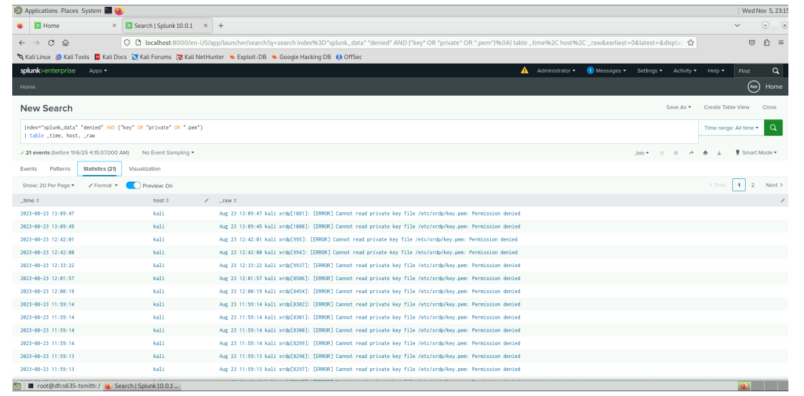
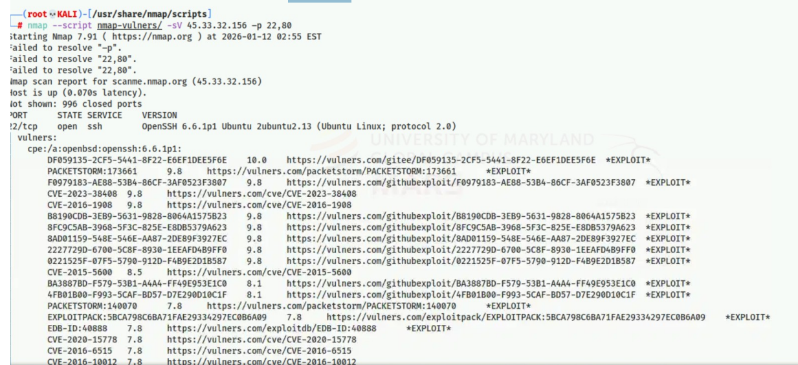

# Network Forensics & Incident Response

## Overview
This directory contains investigations focused on network traffic analysis, vulnerability scanning, and SIEM (Security Information and Event Management) log correlation. The objective is to identify threat actor reconnaissance and track lateral movement through centralized logging.

## Tools
*   **SIEM:** Splunk.
*   **Network Scanning:** Nmap, Nmap Scripting Engine (NSE) `vulners`.

## 🔍 Investigation 1: Threat Hunting via SIEM (Splunk)
**Scenario:** Queried massive log datasets to identify Indicators of Compromise (IoCs) and anomalous user behavior.

**Findings:**
*   **Anomalous Access:** Crafted Splunk queries (`index="splunk_data" "login successful" | eval hour=strftime(_time, "%H") | where hour<9 OR hour>=18`) to detect logins occurring strictly outside of standard business hours.
*   **Privilege Escalation Attempts:** Identified unauthorized users attempting to execute the `chroot` command to escape containerized environments.
*   **Key Theft:** Correlated logs showing denied attempts to read highly sensitive private key files (`.pem`).

## Investigation 2: Active Reconnaissance & Vulnerability Mapping
**Scenario:** Simulated an Incident Response triage process by actively scanning a suspected compromised asset to identify open attack vectors.

**Findings:**
*   **Network Discovery:** Conducted stealth SYN scans (`-sS`) and aggressive OS fingerprinting (`-O -vv`) to map the target environment.
*   **Automated Vulnerability Assessment:** Integrated the `nmap-vulners` NSE script to automatically cross-reference discovered services with known CVE databases, immediately highlighting unpatched software for the incident response team.

